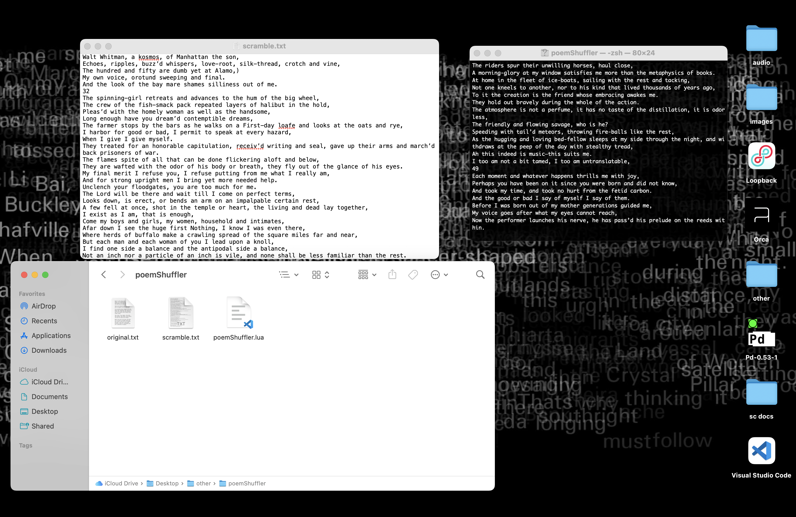

# poemShuffler

This repository contains two scripts. Each script approaches shuffling in a different way and will be suitable for different circumstances. `poemShuffler.lua` takes a single input text, copied into `original.txt`, and shuffles it. `poemShuffler.sh` takes a group of input texts, `.txt` files placed in the `originals` folder, and shuffles them into a single text. In both cases, the result will be found in `shuffled.txt`. To use either script, open a terminal on your computer and `cd` into the folder where you've saved the files from this repository. To use `poemShuffler.lua`, execute `lua poemShuffler.lua` in the terminal (note that you'll need to have lua installed on your computer for this to work). To use `poemShuffler.sh`, execute `zsh ./poemShuffler.sh` in the terminal. Then open `shuffled.txt` to see the results.
